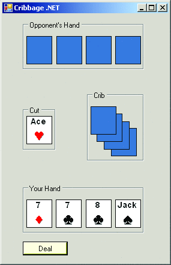
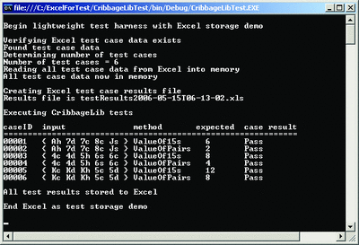

# Introduction
If you are writing test automation, there are four complementary approaches you can take: buy and use a commercial test framework (including Visual Studio® 2005 Team System, which has some neat new features), use an open source test framework, write custom heavyweight automation (generally more than four pages of code), or write lightweight automation (generally under four pages of code). Most of my Test Run columns focus on techniques for lightweight automation. When writing lightweight test automation, one of your best choices for test case data and test results storage is to use Microsoft® Excel®.

In this month's column I will show you how to use Excel for test automation storage. Even though this is aimed at developers with beginning .NET coding skills, intermediate and advanced programmers should still find the information I present here interesting and rather useful.

Suppose you are writing a cribbage game like the one shown in Figure 1. In cribbage, your hand consists of five cards—four in your hand and one shared by you and your opponent. Your point score is determined by a number of factors, such as the number of pairs in your hand and the number of card combinations you hold that sum to 15. Each pair is worth 2 points and each set of cards that sum to 15 is worth 2 points. Face cards count as 10, aces count as 1, and all other cards count as their point value. For the hand shown in Figure 1, the value of the pairs is 2 because there is a single pair of 7s. The value of the 15s is 6 because there are three combinations of cards that sum to 15: the 7 of diamonds and 8 of clubs; the 7 of clubs and 8 of clubs; the 7 of diamonds, 7 of clubs, and ace of hearts.

Behind the scenes, the game UI calls into a CribbageLib class library that you've written. This library houses classes to represent a Card object and a Hand object, as well as methods and properties, such as Hand.ValueOfPairs and Hand.ValueOf15s.

In this column, I will present techniques for using Excel to hold test case data and store test results, as illustrated by the program shown in Figure 2. The lightweight test harness begins by checking to see if the Excel spreadsheet that holds test case data exists. (I'll explain shortly how to set up an Excel spreadsheet so that you can programmatically read from it.) Next, the harness probes into the Excel data to determine the number of test cases and then reads all the Excel data into an in-memory DataTable object. (I'll discuss the alternative approach of reading one test case at a time in the last section of this column.) The harness creates a new Excel spreadsheet to hold test case results, and then executes each test case. The harness determines a pass/fail result for each test, prints the result to the console, and saves the result to the Excel spreadsheet. The complete source code for the test harness and the library under test are in the code download that accompanies this column.

In the sections that follow, I will briefly describe the class library under test so you will understand how to set up appropriate Excel spreadsheets for storage. I will present the code for the simple test harness that produced the results shown in Figure 2. I will explain the code in detail so you will be equipped to modify and extend the code to use Excel to meet your own needs. And I will conclude with a very brief discussion of how and when to use Excel for test storage, looking at the pros and cons of this approach when compared to other types of test storage (SQL Server™ databases, text files, and XML files in particular). I believe you'll find the ability to use Excel for lightweight test storage a useful addition to your software testing, development, and management tool kit.

- [The Library Under Test](The Library under Test.md)
- [The Test Case Data File](The Test case Data File.md)
- [Creating the Test Harness](Creating the Test Harness.md)
- [Storing Results](Storing Results.md)
- [Wrapping Up](Wrapping Up.md)

