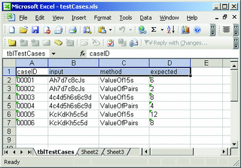

# The Test Case Data File
You typically create your Excel data files manually when using Excel test case data storage for lightweight test automation, (I will demonstrate how to create Excel files programmatically in just a moment.) Manually creating an Excel spreadsheet for test case data is like creating a spreadsheet for any other purpose, but with a couple of added steps. Because my test harness uses OLE DB technology to access Excel programmatically, I need to supply column header labels to identify each column so I can write queries. I also need to create a named area in the spreadsheet to correspond to a SQL table name.

For this example, I want to store a test case ID number (like "00001"), a test case input (like "Ah7d7c8cJs") to represent a cribbage hand, a value to indicate which class property I am sending my input to (like "ValueOf15s"), and an expected result (like "6"). So, I launch Excel, manually type in appropriate column names ("caseID", "input", "method", and "expected"), and manually enter my test case data. To assign a virtual table name to my spreadsheet, I select the column header cells (cells A1 through D1 in this case) and then type a table name into the Excel Name Box field in the upper left-hand corner of the spreadsheet. In this case, I named my table tblTestCases, as you can see in Figure 4.

Although it is not strictly necessary to do so, I also rename the worksheet to the same name as the virtual table name. When programmatically accessing Excel data, the name in the Name Box field (rather than the worksheet name) is used to determine which data to reference. But as you'll see in a moment, when you programmatically create an Excel spreadsheet, the worksheet name receives the same name as that assigned to the Name Box. So renaming the worksheet of Excel test data that has been manually created is more consistent than leaving the worksheet named Sheet1.

If you look closely at the Excel spreadsheet in Figure 4, you will notice that I entered all the test case data as text. For instance, the expected result for the first test case is 6 formatted as text rather than 6 formatted as a numeric type. This is indicated by the small green triangle in cell D2. I recommend you store all test case data as text and then programmatically convert non-string data to the appropriate data type in the test harness. The Excel data model is not the same as the .NET data model. It is generally easier to perform all data type conversions in the harness rather than trying to get data types as close as possible in the spreadsheet.
